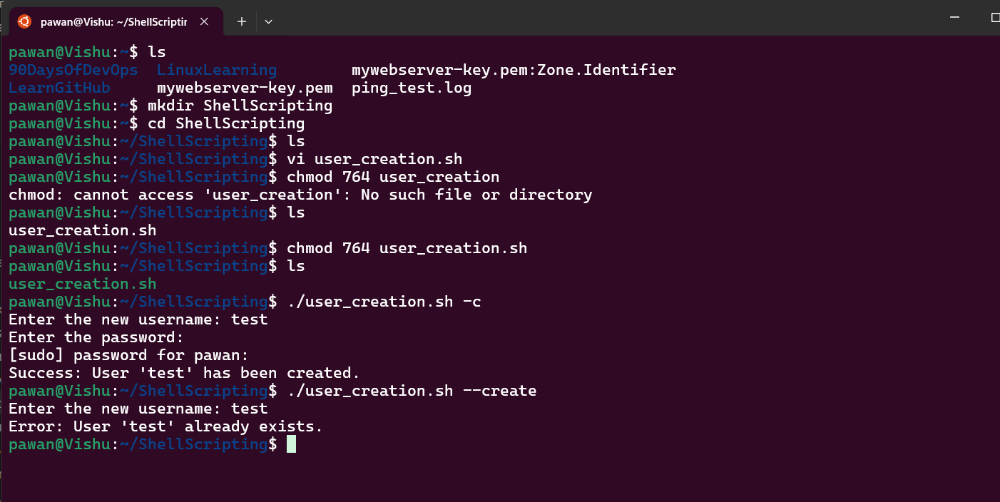
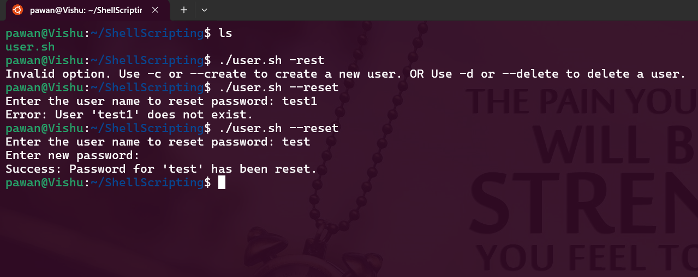
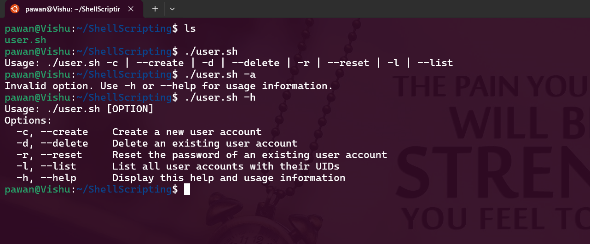

## Script for User Account Management 

<ol>
<li> ✅ Account Creation with option (-c or --create) </li>

<li> ✅ Account Deletion with option (-d or --delete) </li>

<li> ✅ Password Reset with option (-r or --reset) </li>

<li> ✅ List User Accounts with option (-l or --list) </li>

<li> ✅ Help and Usage Information with option (-h or --help) </li>
</ol>

---

Here’s a Bash script that implements the user account creation functionality as described:

[user_management.sh](user_management.sh)

---

This Bash script provides an interactive way to manage user accounts in a Linux system.

---
## 📜 Usage
~~~
./user_management.sh [OPTION]
~~~

Run the script with any of the following options:

✅ Create a new user (-c or --create)

✅ Delete an existing user (-d or --delete)

✅ Reset a user's password (-r or --reset)

✅ List all users (-l or --list)

✅ Display help information (-h or --help)

---
### Part 1: Account Creation
Output: 

### Part 2: Account Deletion
Output:

### Part 3: Reset Password
Output:

### Part 4: List all users
Output:

### Part 5: Help and Usage Information
Output:

